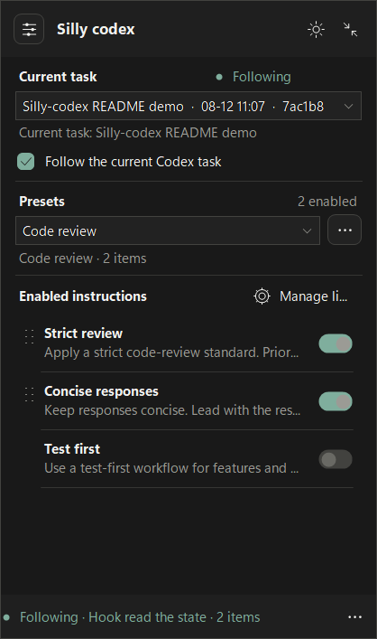
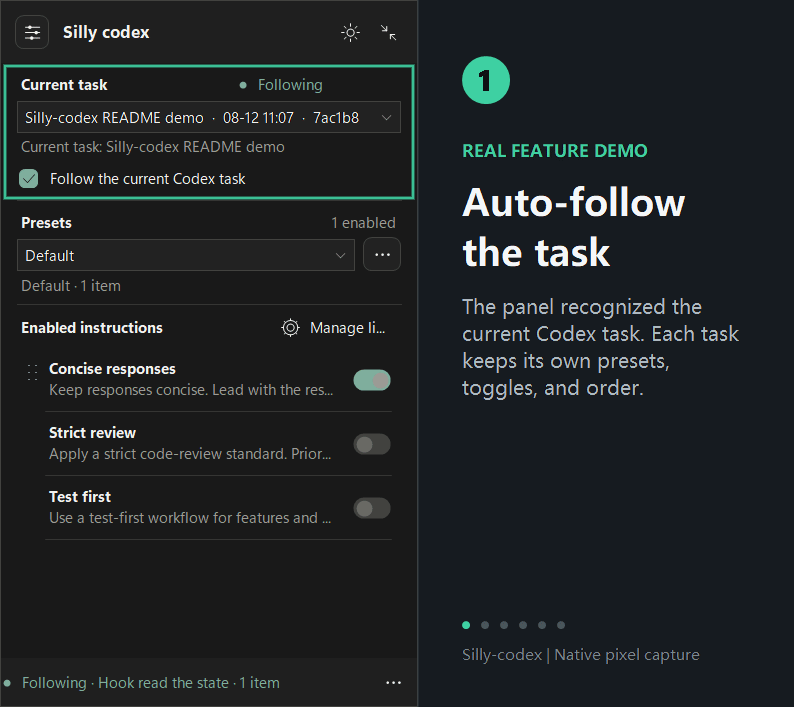
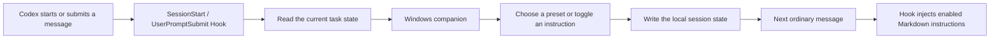

# Silly-codex

<div align="center">

**A task-aware instruction console for Codex.**

Save the ways you work as reusable presets, then turn them on, off, reorder them, or switch them while you stay in the current task. Hooks apply the selected Markdown automatically; the Windows companion keeps the state visible.

[](https://github.com/foryourhealth111-pixel/Silly-codex/releases)
[](LICENSE)
[](https://github.com/foryourhealth111-pixel/Silly-codex/actions/workflows/node-tests.yml)
[](https://github.com/foryourhealth111-pixel/Silly-codex/actions/workflows/windows.yml)

[Chinese README](README.md)

</div>

## See It In 30 Seconds

### What the current task will use

<div align="center">

<a href="docs/assets/instruction-switcher-overview-en.png"></a>

<br>
<sub>Native-size PNG. This English capture uses synthetic task and session data from the real Windows companion.</sub>

</div>

The panel answers three practical questions at a glance: which task is being controlled, which instructions are enabled, and whether the Hook has read the latest state.

### From a preset to the next message

<div align="center">

<a href="docs/assets/instruction-switcher-workflow-en.gif"></a>

<br>
<sub>Native-size workflow animation. Every frame uses synthetic data and contains no local path, real session ID, or chat content.</sub>

</div>

The flow is: detect the task, choose a preset, inspect the order, fine-tune one instruction, wait for the Hook acknowledgement, and collapse the panel to the floating button.

## The Short Version

Silly-codex has three cooperating layers:

| Layer | Responsibility | What you experience |
| --- | --- | --- |
| **Hooks** | Read task state at `SessionStart` and `UserPromptSubmit` | Each task gets its own instruction combination |
| **Local state** | Store Markdown bodies, presets, and per-task switches | Your configuration remains after Codex closes |
| **Windows companion** | Follow the active task and expose toggles and the floating button | You can verify the active rules without leaving Codex |

The Hook is the injection path. The companion is the control and feedback surface. When the window is hidden, `/choose` still manages the current task.

## Why It Helps

Codex work often moves between review, testing, refactoring, and documentation. Each mode has different constraints, and repeatedly copying a long prompt makes the active rules easy to forget.

Silly-codex turns that switch into a visible, task-scoped action:

| Common friction | With Silly-codex |
| --- | --- |
| Copy a long prompt and check for omissions | Choose a preset; the next message reads it automatically |
| Edit one global rule for every conversation | Toggle and order instructions per task |
| Guess which constraints are active | See the task, preset, enabled count, and Hook acknowledgement |
| Let a large panel cover the editor | Collapse to a roughly `58 x 58` floating button or use the tray |
| Carry temporary rules into a new task | Session state is stored under a separate conversation key |

## How It Works



The boundaries stay simple: Hooks read state and inject content, the companion provides controls, and Codex continues to handle the conversation and code work.

## Features

### Task-level control

- Follow the task selected in the Codex sidebar.
- Select a recent task explicitly when you need a manual target.
- Keep an independent enabled list and order for every task.
- Update the panel when the active task changes.

### Presets and instruction library

- Start with example instructions for strict review, test-first work, and concise responses.
- Save combinations as presets such as Code review or Test mode.
- Drag enabled rows to change injection order.
- Edit Markdown, sort entries, import, export, back up, and restore.
- See a custom-selection label after a preset is manually adjusted.

### Companion window

- Start from `SessionStart` and appear near the lower-right corner.
- Use the expanded panel, floating button, or system tray.
- Switch between light and dark themes.
- Switch between Chinese and English from the footer or tray `Language` menu; the choice is saved in the window preferences.
- Suppress the companion while Codex is in the background, then restore the previous panel or floating-button state when Codex returns.
- Press `Esc` to collapse; click the floating button to expand again.

### Command-line fallback

Send a control command in the message box. The Hook handles it and blocks the control text from the model context:

```text
/choose status
/choose list
/choose set review,tdd
/choose on concise
/choose off review
/choose clear
```

Normal messages receive the enabled Markdown instruction bodies automatically.

## Installation

### Option 1: GitHub-backed `npx` (recommended)

Install [Node.js LTS](https://nodejs.org/), then run in PowerShell:

```powershell
npx --yes github:foryourhealth111-pixel/Silly-codex
```

The installer registers or upgrades the `silly-codex` marketplace and installs `instruction-switcher@silly-codex`. It has no runtime npm dependencies and does not use an npm lifecycle script.

The short registry command `npx silly-codex` becomes available after a package is published to the npm registry. The GitHub-backed command above is the current supported route.

### Option 2: Global GitHub install

```powershell
npm install --global github:foryourhealth111-pixel/Silly-codex
silly-codex install
```

This is useful when you repeat the installation or upgrade on multiple Windows machines.

### Option 3: Manual Codex marketplace install

```powershell
codex plugin marketplace add foryourhealth111-pixel/Silly-codex --ref main
codex plugin add instruction-switcher@silly-codex
```

In Codex plugin settings, review and trust `SessionStart` and `UserPromptSubmit`. Restart Codex or create a new task. The companion starts when the Hook receives the task.

### Migrate from the old personal installation

If `instruction-switcher@personal` is installed, fully exit Codex first, then run:

```powershell
npx --yes github:foryourhealth111-pixel/Silly-codex --replace-personal
```

The migration removes the old registration and keeps the instruction library, presets, and task state under `%CODEX_HOME%\\instruction-switcher`.

## First Use

1. Open Codex and enter a task.
2. Wait for the `Silly codex` companion near the lower-right corner.
3. Choose a preset, or toggle an individual instruction.
4. Submit a normal message. The Hook reads the task selection and injects the matching Markdown bodies.
5. Use the collapse button when you want the smaller floating entry point.
6. Open Manage library to edit content or use the backup and import/export actions.

The first run chooses Chinese or English from the Windows UI language. You can change it later from the footer or tray menu. User-authored instruction names and Markdown bodies remain unchanged when the interface language changes.

## Supported Environment

| Component | Requirement |
| --- | --- |
| Codex | Desktop Codex with plugin support, `SessionStart`, and `UserPromptSubmit` |
| Operating system | Windows 10/11 for the full companion; an interactive desktop session is required |
| Node.js | 20 or newer; CI validates Node 22 |
| PowerShell | Required for the installer commands and Windows build scripts |
| Other systems | Hook and local-library logic remain Node-based; the WinForms companion only starts on Windows |

Remote, locked, or headless desktops can prevent the companion from being visible. `/choose` remains available for state control.

## Data And Privacy

- Configuration, instruction bodies, presets, import/export files, and task state stay on the local machine.
- The companion only reads the Codex debugging endpoint on loopback to identify the selected task.
- The project has no telemetry, advertising, remote account service, or automatic upload.
- Import, export, and opening the data folder are explicit user actions.
- Removing the plugin registration does not remove the library. Deleting the data directory removes local instructions, presets, and task state.

Default data directory:

```text
%CODEX_HOME%\\instruction-switcher
```

When `CODEX_HOME` is unset, the directory is `%USERPROFILE%\\.codex\\instruction-switcher`. Set `INSTRUCTION_SWITCHER_HOME` to use an isolated data root. See [PRIVACY.md](PRIVACY.md).

## Upgrade, Uninstall, And Troubleshooting

Upgrade:

```powershell
codex plugin marketplace upgrade silly-codex
codex plugin add instruction-switcher@silly-codex
```

Uninstall:

```powershell
codex plugin remove instruction-switcher@silly-codex
```

When the companion does not appear:

1. Check `node --version` and confirm Node.js is on `PATH`.
2. Confirm both Hooks are trusted and enabled in Codex plugin settings.
3. Fully exit Codex and open a new task.
4. Use the system tray menu to show the panel or floating button.
5. Run `/choose status` to verify that the Hook can read task state.

## Development And Validation

The repository has no npm runtime dependencies. Node tests use the built-in `node:test`; the Windows companion is compiled with the system .NET Framework C# compiler.

```powershell
node --test plugins/instruction-switcher/tests/*.test.mjs
npm pack --dry-run --json
powershell -NoProfile -File plugins/instruction-switcher/scripts/build-companion.ps1
powershell -NoProfile -File plugins/instruction-switcher/tests/companion-lifecycle.test.ps1
powershell -NoProfile -File plugins/instruction-switcher/tests/library-package.test.ps1
powershell -NoProfile -File plugins/instruction-switcher/tests/theme-transition-layer.test.ps1
node scripts/validate-plugin.mjs
```

GitHub Actions run Node tests, Windows builds, plugin validation, and sensitive-information scans. Releases contain the source archive plus a verified, Authenticode-signed companion executable, LICENSE, and NOTICE. The project does not publish a custom self-extracting plugin archive.

## Repository And License

```text
Silly-codex/
├─ plugins/instruction-switcher/   # Hooks, companion, defaults, and tests
├─ scripts/                        # GitHub-backed installer and validators
├─ .github/workflows/              # CI, Windows build, release, and scans
├─ docs/assets/                    # README screenshot and workflow animation
├─ LICENSE                         # Apache License 2.0
└─ PRIVACY.md                      # Local data handling
```

Source code, tests, documentation, build scripts, and bundled default instructions are released under the [Apache License 2.0](LICENSE). The author is [@foryourhealth111-pixel](https://github.com/foryourhealth111-pixel). See [SECURITY.md](SECURITY.md), [CONTRIBUTING.md](CONTRIBUTING.md), and [CODE_SIGNING_POLICY.md](CODE_SIGNING_POLICY.md) for project policies.
