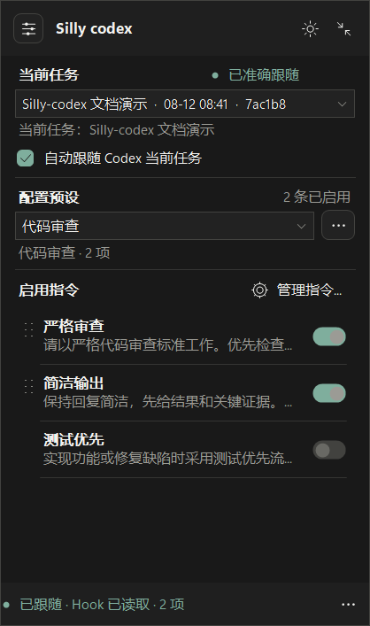
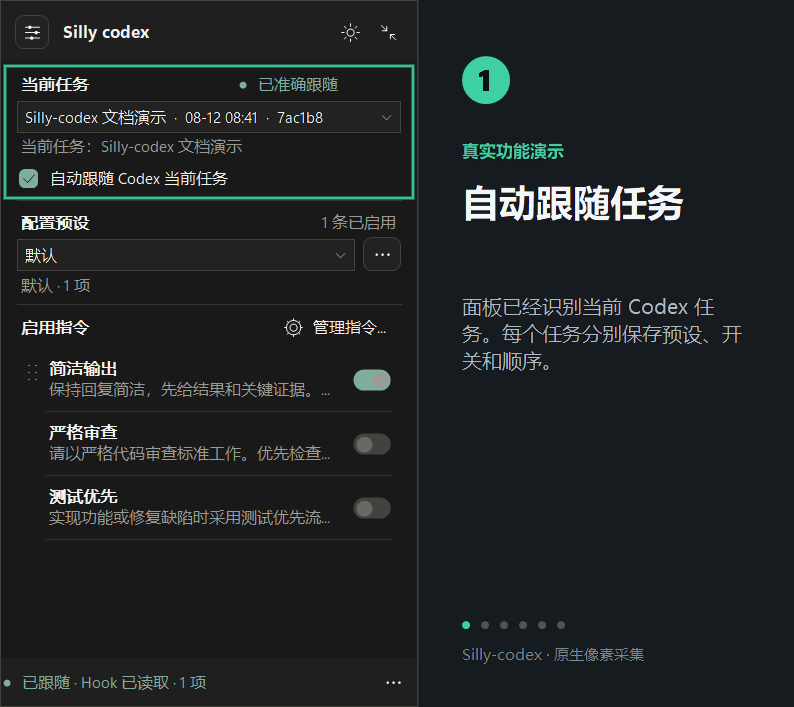
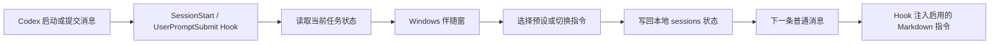

# Silly-codex

English documentation: [README.en.md](README.en.md)

<div align="center">

**给 Codex 一块随任务移动的指令控制台。**

把常用的工作方式保存成预设，在当前任务里随时打开、关闭、排序和切换。配置由 Hook 自动注入，Windows 伴随窗负责把状态放到眼前。

[](https://github.com/foryourhealth111-pixel/Silly-codex/releases)
[](LICENSE)
[](https://github.com/foryourhealth111-pixel/Silly-codex/actions/workflows/node-tests.yml)
[](https://github.com/foryourhealth111-pixel/Silly-codex/actions/workflows/windows.yml)

</div>

## 30 秒看懂它怎么工作

### 当前任务里，哪些指令会生效

<div align="center">

<a href="docs/assets/instruction-switcher-overview.png"></a>

<br>
<sub>原生尺寸 PNG。图中任务与会话信息均为合成演示数据，控件和状态来自真实 Windows 伴随窗。</sub>

</div>

这张图集中回答三个最重要的问题：面板正在控制哪个任务、当前启用了哪些指令、Hook 是否已经读取最新状态。示例中选中了“代码审查”预设，“严格审查”和“简洁输出”会按列表顺序应用到下一条消息。

### 从选择预设到下一条消息生效

<div align="center">

<a href="docs/assets/instruction-switcher-workflow.gif"></a>

<br>
<sub>原生尺寸功能动图。依次展示任务跟随、应用预设、单条微调、Hook 回执和悬浮球。</sub>

</div>

动图对应一次完整操作：识别当前任务 → 选择“代码审查” → 查看启用顺序 → 打开“测试优先” → 等待 `Hook 已读取` → 收起为悬浮球。每一帧都使用合成任务数据，公开素材不包含本机路径、真实会话 ID 或聊天内容。

## 一句话理解

你可以把它看成三层配合：

| 层 | 负责什么 | 你能感受到的结果 |
| --- | --- | --- |
| **Hook** | 在 `SessionStart` 和 `UserPromptSubmit` 时读取任务状态 | 每个任务拥有自己的指令组合 |
| **本地状态** | 保存指令正文、预设和任务开关 | 关闭 Codex 后配置仍然保留 |
| **Windows 伴随窗** | 跟随当前任务，提供可视化开关和悬浮球 | 选择规则时不用离开 Codex |

核心注入链由 Hook 完成。窗口承担控制和反馈。窗口暂时不可见时，`/choose` 命令仍可管理当前任务。

## 它解决的日常问题

长时间使用 Codex 时，工作会在代码审查、测试、重构、写文档等模式之间切换。每种模式都有自己的要求，手动复制长提示会带来记忆负担，也容易把上一项工作的规则带到下一项任务。

Silly-codex 把这段切换变成一个可见的动作：

| 以前常见的操作 | 使用 Silly-codex 后 |
| --- | --- |
| 复制一段长提示，再检查有没有漏句子 | 选择一个预设，下一条消息自动读取 |
| 在全局配置里反复改规则 | 在当前任务里独立开关和排序 |
| 忘记当前任务启用了哪些约束 | 面板显示当前任务和已启用数量 |
| 窗口挡住编辑区域 | 折叠成约 `58 × 58` 的悬浮球，或交给托盘 |
| 新任务继承了旧任务的临时设置 | 任务状态按会话键分开保存 |

## 运行链路



这条链路把“选择规则”和“执行任务”分开。Hook 只处理状态读取和指令注入，伴随窗只提供控制界面，Codex 继续负责对话和代码工作。

## 为什么这样设计

### 1. 把配置放到任务边界里

每个任务都有自己的状态文件和启用顺序。代码审查、测试、写作等工作可以同时进行，规则互相独立。用户切换任务时，面板跟随任务，记忆成本随之下降。

### 2. 把隐性的提示变成可见的控制面

长提示通常藏在聊天记录或全局配置里。面板把当前任务、预设名称、启用数量和每条指令直接展示出来。用户可以快速确认当前规则，也可以立即撤销一次临时选择。

### 3. 让 Hook 与伴随窗各司其职

Hook 负责可靠地读取和注入内容。伴随窗负责选择、排序和反馈。两部分边界清晰，窗口生命周期变化不会改变核心注入逻辑，命令行入口也能覆盖无窗口场景。

### 4. 用三种可见性适应不同工作节奏

展开面板适合集中配置，悬浮球适合快速回到控制面，托盘适合长时间保持后台运行。用户可以在“看得见”和“尽量少打扰”之间自由切换。

### 5. 本地优先，迁移可控

指令正文、预设和任务状态保存在用户自己的目录。导入导出由用户主动操作，备份可以跟随个人工作流保存。项目的默认运行路径没有遥测和远程同步，排查问题时也更容易定位文件。

这些设计带来的直接便利：

| 设计取舍 | 用户获得的便利 |
| --- | --- |
| 任务级状态 | 多个任务并行时，规则不会串线 |
| 可见的开关和计数 | 提交消息前可以快速核对当前模式 |
| Hook 与窗口分层 | 窗口暂时隐藏时，注入链仍然可用 |
| 面板、悬浮球、托盘 | 配置、快速切换、后台驻留各有入口 |
| 本地文件库 | 内容可编辑、可备份、可迁移，数据边界清楚 |

## 功能地图

### 任务级控制

- 自动跟随 Codex 侧栏当前选中的任务。
- 从最近任务列表中显式指定写入目标。
- 每个任务保存独立的启用列表和顺序。
- 当前任务切换后，面板同步显示新的状态。

### 预设与指令库

- 内置“严格审查”“测试优先”“简洁输出”等示例指令。
- 将多个指令保存为“代码审查”“测试模式”等配置预设。
- 拖动已启用指令，调整注入顺序。
- 编辑 Markdown 正文、排序、导入、导出和备份。
- 修改后的预设会显示为自定义配置，便于识别当前差异。

### 伴随窗体验

- `SessionStart` 自动启动，右下角置顶停靠。
- 展开面板、悬浮球、系统托盘三种入口。
- 深色与浅色主题，主题选择会保存。
- 支持中文与英文界面，底部菜单和托盘菜单都可切换语言。
- Codex 进入后台时自动抑制窗口，回到前台后恢复上次显示形态。
- `Esc` 可以把面板收束为悬浮球，单击悬浮球恢复面板。

### 无窗口控制

在消息框中发送下面的控制命令。命令由 Hook 处理，控制文本不会进入模型上下文。

```text
/choose status
/choose list
/choose set review,tdd
/choose on concise
/choose off review
/choose clear
```

## 快速安装

### 方式一：GitHub-backed `npx`（推荐）

先安装 [Node.js LTS](https://nodejs.org/)，然后在 PowerShell 执行：

```powershell
npx --yes github:foryourhealth111-pixel/Silly-codex
```

安装器会完成以下动作：

1. 通过 Codex 官方 CLI 登记 `silly-codex` marketplace。
2. 安装 `instruction-switcher@silly-codex`。
3. 保持安装过程零第三方依赖，安装器自身也不使用 `postinstall` 脚本。

当前命令直接从 GitHub 获取仓库内容。npm registry 的短命令 `npx silly-codex` 会在正式发布 npm 包后启用。

### 方式二：全局安装 GitHub 命令

```powershell
npm install --global github:foryourhealth111-pixel/Silly-codex
silly-codex install
```

这条方式适合需要多次升级或在多台 Windows 机器上重复安装的场景。

### 方式三：Codex marketplace 手工安装

```powershell
codex plugin marketplace add foryourhealth111-pixel/Silly-codex --ref main
codex plugin add instruction-switcher@silly-codex
```

安装完成后，在 Codex 的插件设置里审核并信任 `SessionStart` 与 `UserPromptSubmit` Hook。重新启动 Codex，或创建一个新任务，伴随窗会自动出现。

### 从旧的 personal 安装迁移

系统里存在 `instruction-switcher@personal` 时，先完全退出 Codex，再执行：

```powershell
npx --yes github:foryourhealth111-pixel/Silly-codex --replace-personal
```

手工迁移也可以使用：

```powershell
codex plugin remove instruction-switcher@personal
codex plugin marketplace add foryourhealth111-pixel/Silly-codex --ref main
codex plugin add instruction-switcher@silly-codex
```

迁移会保留 `%CODEX_HOME%\instruction-switcher` 下的指令库、预设和任务状态。

## 第一次使用

1. 打开 Codex 并进入一个任务。
2. 等待右下角出现 `Silly codex` 伴随窗。
3. 在“配置预设”里选择一个预设，或直接打开单条指令。
4. 提交下一条普通消息，Hook 会读取当前任务的启用列表并注入对应 Markdown 正文。
5. 需要专注编辑区时，点击右上角折叠按钮，保留悬浮球入口。
6. 需要管理正文或备份时，打开“管理指令”或底部更多菜单。

首次运行会参考 Windows 界面语言。语言选择保存在窗口偏好中；切换界面语言会保留用户已有的指令名称、预设名称和 Markdown 正文。英文环境的全新指令库会使用英文示例内容。

### 一个具体例子

代码审查任务可以选择“代码审查”预设，包含“严格审查”和“简洁输出”。切换到测试任务后，可以选择“测试模式”，启用“测试优先”和“简洁输出”。两个任务的开关和顺序分别保存，任务之间互不覆盖。

## 适配环境

| 项目 | 要求 |
| --- | --- |
| Codex | 支持插件、`SessionStart`、`UserPromptSubmit` Hook 的 Codex 桌面环境 |
| 操作系统 | Windows 10/11 桌面会话可使用完整伴随窗；需要可交互的前台桌面 |
| Node.js | 20 或更高版本；Node.js 22 LTS 是 CI 验证版本 |
| PowerShell | 安装过程只需 PowerShell 执行命令；构建脚本使用 Windows PowerShell 兼容语法 |
| 其他系统 | Hook 与本地指令库保持 Node.js 逻辑；Windows 伴随窗只在 Windows 上启动 |

完整伴随窗依赖 Windows WinForms 和系统托盘。远程、锁屏或无头桌面会影响窗口展示；`/choose` 命令仍可用于状态控制。

## 数据、隐私与边界

- 配置、指令正文、预设、导入导出文件和任务状态全部写入本机。
- 伴随窗只连接 Codex 在回环地址提供的调试端口，用于识别当前选中的任务。
- 项目不包含遥测、广告、远程账户服务和自动上传。
- 导入、导出和打开配置目录都由用户主动触发。
- 删除插件登记不会自动删除用户库；删除运行目录才会清除本地数据。

默认数据目录：

```text
%CODEX_HOME%\instruction-switcher
```

当 `CODEX_HOME` 未设置时，实际目录为：

```text
%USERPROFILE%\.codex\instruction-switcher
```

环境变量 `INSTRUCTION_SWITCHER_HOME` 可以指定独立的数据目录。完整说明见 [PRIVACY.md](PRIVACY.md)。

## 升级、卸载与故障排查

升级：

```powershell
codex plugin marketplace upgrade silly-codex
codex plugin add instruction-switcher@silly-codex
```

卸载：

```powershell
codex plugin remove instruction-switcher@silly-codex
```

看不到伴随窗时，可以按下面顺序检查：

1. 确认 Node.js 位于 PATH：`node --version`。
2. 在 Codex 插件设置中确认两个 Hook 已审核并启用。
3. 完全退出 Codex，再重新打开一个任务。
4. 查看系统托盘里的 `Silly codex` 图标，选择“显示面板”或“显示悬浮球”。
5. 临时使用 `/choose status` 检查 Hook 是否能读取任务状态。

## 开发与验证

仓库保持零 npm 运行时依赖。Node 测试使用内置 `node:test`，Windows 伴随窗使用系统 .NET Framework C# 编译器。

```powershell
node --test plugins/instruction-switcher/tests/*.test.mjs
npm pack --dry-run --json
powershell -NoProfile -File plugins/instruction-switcher/scripts/build-companion.ps1
powershell -NoProfile -File plugins/instruction-switcher/tests/companion-lifecycle.test.ps1
powershell -NoProfile -File plugins/instruction-switcher/tests/library-package.test.ps1
powershell -NoProfile -File plugins/instruction-switcher/tests/theme-transition-layer.test.ps1
node scripts/validate-plugin.mjs
```

GitHub Actions 会执行 Node 测试、Windows 构建、插件结构校验和敏感信息扫描。发布流程不会生成额外的自定义插件 ZIP；GitHub Release 使用源码归档并附带经过校验的 Windows EXE、许可证和 NOTICE 文件。

## 发布状态

当前公开安装 ref 为 `main`。SignPath Foundation 的签名配置完成后，维护者会创建 `v0.1.0` Release，并将经过 Authenticode 校验的伴随窗 EXE 附加到 Release 页面。签名策略和所需配置见 [CODE_SIGNING_POLICY.md](CODE_SIGNING_POLICY.md)。

## 仓库结构

```text
Silly-codex/
├─ plugins/instruction-switcher/   # Hook、伴随窗、默认指令、测试
├─ scripts/                        # GitHub-backed npx 安装器与校验器
├─ .github/workflows/              # CI、Windows 构建、发布与扫描
├─ docs/assets/                    # README 运行截图与 GIF
├─ LICENSE                         # Apache License 2.0
└─ PRIVACY.md                      # 本地数据处理说明
```

## 许可证与作者

源代码、测试、文档、构建脚本和随包默认指令内容按 [Apache License 2.0](LICENSE) 发布。

作者：[@foryourhealth111-pixel](https://github.com/foryourhealth111-pixel)。Codex 与 OpenAI 是其各自所有者的商标，本项目保持独立运行和发布。

安全问题请参阅 [SECURITY.md](SECURITY.md)，贡献流程请参阅 [CONTRIBUTING.md](CONTRIBUTING.md)，签名流程请参阅 [CODE_SIGNING_POLICY.md](CODE_SIGNING_POLICY.md)。
