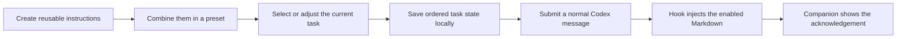

<div align="center">

# Silly Codex

**Reusable instructions that follow the way you work.**

**[English](README.md) | [简体中文](README.zh-CN.md)**

[](LICENSE)
[](https://github.com/foryourhealth111-pixel/Silly-codex/actions/workflows/node-tests.yml)
[](https://github.com/foryourhealth111-pixel/Silly-codex/actions/workflows/windows.yml)

</div>

Save the small rules that shape good AI collaboration, combine them for each task, and apply the active set to each normal message in that task.

<div align="center">

<a href="docs/assets/instruction-switcher-overview-en.png"></a>

<br>
<sub>The screenshot uses a synthetic task and a demo preset. New installations include six editable instructions and no presets.</sub>

</div>

## What is Silly Codex?

Silly Codex is a Codex plugin for managing reusable instructions. A rule can be as small as "reply in Chinese," "use this code style," "run tests first," or "return a table." Each rule lives as its own Markdown instruction instead of disappearing into chat history or growing inside one large prompt file.

You choose an ordered set of instructions for the current task. The plugin stores that selection locally, and its `UserPromptSubmit` Hook adds the enabled instruction bodies to each normal message. A Windows companion keeps the active task, preset, order, and Hook acknowledgement visible.

The instruction library is shared across tasks. Each Codex task keeps its own selection, and an optional default preset can initialize new tasks. This gives long-running preferences a stable home while leaving room for temporary, task-specific changes.

## Why Silly Codex?

Small preferences matter, yet they are easy to lose between conversations. Copying a large prompt into every task also makes it hard to tell which rules are active.

| Common problem | How Silly Codex handles it | Result |
| --- | --- | --- |
| Language, style, testing, and output preferences are scattered across chats | Save each preference as an editable instruction | Mature rules remain available after a conversation ends |
| Review, implementation, research, and documentation need different guidance | Build ordered presets and adjust them per task | Each task receives a focused combination |
| A new conversation starts without your established working habits | Apply a saved preset or choose a default preset for new tasks | Familiar collaboration patterns return quickly |
| A temporary rule leaks into unrelated work | Store the enabled list under the Codex session key | Existing tasks resume their own selections |
| A useful rule set is difficult to move or share | Export an instruction, a preset with its dependencies, or a library backup | Rules can move between machines and people as local files |

## Core features

| Capability | What it gives you |
| --- | --- |
| Instruction library | Create, edit, search, hide, and delete named Markdown instructions |
| Ordered presets | Combine instructions for a scenario, control their injection order, and save the result for reuse |
| Per-task state | Keep independent enabled lists for parallel Codex tasks and restore them when those tasks resume |
| Runtime controls | Apply a preset, toggle individual instructions, reorder them, or undo a preset change from the companion |
| Portable packages | Preview and import `.ispkg.json` files with create, reuse, update, copy, or skip decisions |
| Local-first storage | Keep the library, presets, and task state under your Codex data directory |
| Window-free fallback | Manage the current task with `/choose` commands when the companion is hidden or unavailable |

The Windows companion can follow the task selected in the Codex sidebar. It also exposes discovered recent tasks as explicit targets. The interface can remain expanded, collapse to a small floating button, or stay in the system tray.

## How it works



1. Instructions and presets live in one local library.
2. Each Codex session stores an ordered list of enabled instruction IDs.
3. Applying a preset replaces that list. Manual toggles or drag-and-drop changes produce a custom selection.
4. On the next normal message, the Hook reads the latest state and injects the instruction bodies in order.
5. `/choose` control messages are handled by the Hook and kept out of the model context.

<div align="center">

<a href="docs/assets/instruction-switcher-workflow-en.gif"></a>

<br>
<sub>Synthetic task data demonstrates the real Windows companion workflow.</sub>

</div>

## Typical use cases

- Save code style, response language, testing expectations, and output formats as separate instructions.
- Create a strict review preset for one project and a concise implementation preset for another.
- Start a new task with a default collaboration baseline, then add a temporary rule without changing other tasks.
- Resume an older task and recover the instruction order it used previously.
- Export a proven review or writing preset, including every instruction it needs, for a teammate or community member.
- Keep a personal library on one machine, then move it with a full library backup.

## Quick start

### Requirements

| Component | Requirement |
| --- | --- |
| Codex | Desktop environment with plugin support and the `SessionStart` and `UserPromptSubmit` Hooks |
| Codex CLI | Available on `PATH` for installation |
| Node.js | Version 20 or newer |
| Windows | Windows 10/11 with an interactive desktop for the full companion experience |

The Hook and local library are Node.js based. The visual companion starts only on Windows.

### Install

The current installer is fetched directly from the GitHub repository. Run this command in PowerShell:

```powershell
npx --yes github:foryourhealth111-pixel/Silly-codex
```

The installer registers or upgrades the `silly-codex` marketplace, then installs `instruction-switcher@silly-codex`. The package and plugin have no third-party npm runtime dependencies, and the installer uses no lifecycle or `postinstall` script.

After installation:

1. Review and trust the `SessionStart` and `UserPromptSubmit` Hooks in Codex plugin settings.
2. Restart Codex or open a new task.
3. Open **Settings > Instruction library** in the companion. Edit a starter instruction or create one for a preference you use often.
4. Open **Presets**, create a preset, choose its instructions, and drag them into the required order.
5. Return to the companion, apply the preset, and submit a normal message.

The first run creates six editable starter instructions. The preset list starts empty, so your first useful setup is usually one instruction and one preset that match your own workflow.

### Notes for CCS users and new tasks

**If you use CCS:** Silly Codex registers a plugin and two Hooks during installation. If CCS has not synchronized the current Codex configuration, the installation may appear incomplete or the companion may not launch. Check the CCS global configuration and confirm that it contains these entries:

```toml
[plugins."instruction-switcher@silly-codex"]
enabled = true

[hooks.state."instruction-switcher@silly-codex:hooks/hooks.json:session_start:0:0"]
trusted_hash = "<generated-hash>"

[hooks.state."instruction-switcher@silly-codex:hooks/hooks.json:user_prompt_submit:0:0"]
trusted_hash = "<generated-hash>"
```

`<generated-hash>` is a placeholder for the value generated by Codex. Re-enable the plugin and review and trust both Hooks in the active Codex configuration so that Codex writes the current values. This configuration-sync issue has caught the maintainer too :rofl:.

**For a brand-new task:** Before the first message is recorded, Codex may not have created a conversation record or session ID. The Silly Codex companion cannot discover that blank task yet. Send one message to create the session, then select or apply your rules; enabled instructions will apply to subsequent normal messages in that task.

<details>
<summary>Manual marketplace installation</summary>

```powershell
codex plugin marketplace add foryourhealth111-pixel/Silly-codex --ref main
codex plugin add instruction-switcher@silly-codex
```

</details>

### Control without the companion

Send these commands in the Codex message box. `/choose list` shows the IDs needed by the other commands.

```text
/choose help
/choose status
/choose list
/choose preset <preset-id>
/choose set <instruction-id-1>,<instruction-id-2>
/choose on <instruction-id>
/choose off <instruction-id>
/choose clear
```

The Hook handles these messages as controls, so their text is not sent to the model.

## Import, export, and sharing

Open **Settings** in the companion to work with portable package files:

| Action | Where | Package contents |
| --- | --- | --- |
| Export an instruction | **Instruction library > Export selected instruction** | The selected instruction and its Markdown body |
| Export a preset | **Presets > Export preset** | The preset plus every instruction it references |
| Import a package | **Import package** | A preview of incoming instructions, presets, dependencies, and conflicts |
| Back up the library | **More > Back up library** | Instructions, presets, the control command, and the default preset |
| Restore a backup | **More > Restore backup** | Replaces the current instruction library and presets after confirmation |

Imports are reviewed before anything is written. For each match or conflict, the preview can create a new item, reuse identical local content, update an imported item, keep the local version and create a copy, or skip the item. A preset package carries its complete instruction dependency set, so recipients do not need to recreate the preset by hand.

Share the resulting `.ispkg.json` file through any channel you already use. Silly Codex does not provide cloud sync, accounts, or public sharing links.

> A full library backup does not include per-task session state or window, language, and theme preferences. Restoring a backup replaces the current library and presets; review the preview before confirming.

## Compared with `AGENTS.md` and skills

Silly Codex, [`AGENTS.md`](https://developers.openai.com/codex/guides/agents-md/), and [skills](https://developers.openai.com/codex/skills/) solve different parts of instruction management.

| | Silly Codex | `AGENTS.md` | Skills |
| --- | --- | --- | --- |
| Primary use | Small behavior rules and personal preferences | Stable global or repository guidance | Repeatable task workflows and capabilities |
| Content unit | A named Markdown instruction | A scoped Markdown file | A `SKILL.md` package with optional scripts and resources |
| Activation | Visual per-task selection or `/choose`; applied to normal messages | Discovered from global and directory scope when a run starts | Invoked explicitly or selected when its description matches the task |
| Composition | Ordered items saved as presets and adjusted at runtime | Layered files combined by directory precedence | One or more self-contained skill packages |
| Sharing | Exportable instruction and preset packages | Copy or commit the Markdown files | Share the skill directory or distribute it in a plugin |
| Best fit | Preferences that change by task and need quick, visible switching | Rules that should consistently follow a user, repository, or subtree | Procedures that need detailed steps, references, tools, or scripts |

They work well together. Keep repository invariants in `AGENTS.md`, use skills for complete procedures, and use Silly Codex for the small, frequently recombined preferences that shape day-to-day output.

## FAQ

### Does every new task receive all starter instructions?

No. A new installation contains six editable instruction entries, but no preset and no enabled selection. You decide what to apply. If you set a default preset in **Settings > Presets**, new tasks start with that ordered combination.

### What persists across conversations?

The instruction library and presets are shared locally. Each discovered Codex session keeps its own enabled list and order. Returning to an existing task restores that task's selection; a new task uses the default preset only when one is configured.

### What happens after I edit an instruction?

Presets and task state reference stable instruction IDs. The next Hook read uses the updated Markdown wherever that instruction is enabled.

### Do subagent tasks inherit the current selection?

No. State is stored under each session ID. A subagent task does not inherit the parent task's current selection. If a default preset is configured, the subagent session can initialize from that default as its own selection.

### Is Windows required?

Windows 10/11 is required for the WinForms companion, floating button, and tray menu. On other systems, the companion is skipped. The Node.js Hook and `/choose` control path remain available where the Codex plugin and Hook environment are supported.

### Where is my data stored?

The default location is:

```text
%CODEX_HOME%\instruction-switcher
```

When `CODEX_HOME` is unset, this resolves to `%USERPROFILE%\.codex\instruction-switcher`. Set `INSTRUCTION_SWITCHER_HOME` before Codex starts to use another local directory. The Settings window can display and open the active directory.

### Does Silly Codex upload my instructions?

No automatic upload, telemetry, advertising, or remote account service is included. Task tracking reads the local Codex debugging endpoint and related local state, then writes the result under the plugin data directory. Package files leave the machine only when you share them. See [PRIVACY.md](PRIVACY.md) for the data boundary.

## Contributing

Bug reports, documentation fixes, and focused code changes are welcome. See [CONTRIBUTING.md](CONTRIBUTING.md) for the local checks and submission guidelines. Report security issues through the process in [SECURITY.md](SECURITY.md).

## License

The repository source, tests, documentation, build scripts, and bundled starter instructions are available under the [Apache License 2.0](LICENSE). Content you create in your local instruction library remains under your control. Third-party acknowledgements are listed in [THIRD_PARTY_NOTICES.md](THIRD_PARTY_NOTICES.md).

Silly Codex is an independent project by [@foryourhealth111-pixel](https://github.com/foryourhealth111-pixel). Codex and OpenAI are trademarks of their respective owners.

## Acknowledgements

Thanks to the [Linux.do](https://linux.do/) community for its support.
