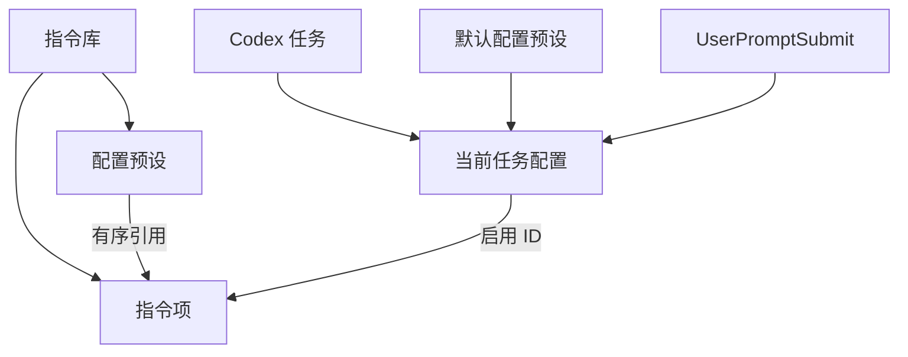

# Instruction Switcher 指令库架构

## 目标

这次改造把“启用指令”从固定的三个内置条目升级为可维护的个人指令库，同时保留任务级隔离和即时跟随能力。

核心体验是三步：

1. 用户在指令库创建或编辑指令项。
2. 用户把多条指令项保存成配置预设。
3. 用户在任意 Codex 任务中一键应用配置预设，也可以临时逐项微调。

本设计保持以下边界：指令库和配置预设属于全局个人库；当前任务配置属于单个 Codex 任务；分组不进入第一版领域模型。

许可证边界：仓库内的源代码、测试、文档、构建脚本和随包默认种子按 Apache License 2.0 授权。安装后的运行时目录由用户控制，用户原创内容保留用户自己的权利；从随包种子复制出的部分继续按 Apache-2.0 使用。

## 领域模型



### 指令项

指令项是独立可开关的完整 Markdown/纯文本内容。它拥有不可变的内部 ID，用户可以修改名称、正文和显示顺序。

建议字段：

```json
{
  "id": "review",
  "name": "严格审查",
  "file": "instructions/review.md",
  "origin": "local",
  "sourcePackageId": null,
  "sourcePackageKey": null,
  "sourceContentHash": null,
  "showInCustomPicker": true,
  "createdAt": "2026-08-10T00:00:00.000Z",
  "updatedAt": "2026-08-10T00:00:00.000Z"
}
```

现有 `review`、`tdd`、`concise` ID 继续沿用，避免迁移时破坏已有任务状态。新建条目使用随机稳定 ID；ID 不显示在界面中。

`origin` 记录条目的初始来源，可取 `local`、`instruction-package` 或 `preset-package`。包来源条目通过 `sourcePackageId` 和 `sourcePackageKey` 保留来源身份，`sourceContentHash` 记录上次接受的包内正文指纹，用于识别后续包更新与本地编辑。`showInCustomPicker` 只控制自定义配置候选列表；当前任务配置和 Hook 执行继续由启用 ID 决定。通过配置预设包携带的随包指令项初始值为 `false`，本地创建或通过指令包导入的条目初始值为 `true`。用户可以随时修改该值。

### 配置预设

配置预设保存一组有序且不重复的指令项 ID：

```json
{
  "id": "preset-code-review",
  "name": "代码审查",
  "instructionIds": ["review", "concise"],
  "origin": "local",
  "sourcePackageId": null,
  "sourcePackageKey": null,
  "sourceContentHash": null,
  "createdAt": "2026-08-10T00:00:00.000Z",
  "updatedAt": "2026-08-10T00:00:00.000Z"
}
```

配置预设使用与指令项一致的来源字段，导入器据此识别同一包系列中的复用、更新和本地修改。应用预设会整体替换当前任务配置。用户修改单条开关后，当前任务标记为“自定义”；用户可以保存为新预设，也可以明确更新原预设。

### 当前任务配置

任务状态继续使用会话键隔离，并扩展当前预设信息：

```json
{
  "version": 3,
  "enabled": ["review", "concise"],
  "activePresetId": "preset-code-review",
  "revision": "uuid",
  "updatedAt": "2026-08-10T00:00:00.000Z"
}
```

`activePresetId` 为空时显示“自定义”。当用户手动调整后又恢复成某个预设的完整有序列表，可以重新识别为该预设。

## 配置文件布局

```text
%CODEX_HOME%\instruction-switcher\
├─ config.json
├─ instructions\
│  ├─ review.md
│  ├─ tdd.md
│  └─ concise.md
├─ sessions\
│  └─ <session-key>.json
└─ exports\
```

`config.json` 保存指令项元数据、配置预设和默认预设 ID：

```json
{
  "version": 3,
  "command": "/choose",
  "defaultPresetId": "preset-code-review",
  "instructions": [],
  "presets": []
}
```

指令正文单独存放为 Markdown 文件，避免大型正文挤入元数据 JSON，也方便导入、导出和人工备份。所有相对路径都必须限制在 `instructions` 目录内。

## 引用清理规则

指令项删除后，系统按以下顺序处理：

1. 从所有配置预设的 `instructionIds` 中过滤该 ID。
2. 从当前任务的 `enabled` 中过滤该 ID。
3. 当前预设变成空集合时仍保持有效，应用它会清空当前任务指令。
4. 界面显示一条轻量提示，说明有若干条失效引用已被清理。
5. Hook 读取到缺失 ID 时采用同样的过滤规则，并继续处理剩余正文。

这个流程保持配置可用，删除动作不会阻断任务或产生 Hook 错误。

## 迁移策略

迁移从旧版 `profiles` 和 `presets/*.md` 开始：

1. 为现有 profile 建立指令项元数据，保留原 ID。
2. 将现有 Markdown 文件复制到 `instructions/<id>.md`。
3. 保留旧文件直到新配置成功写入，迁移过程使用临时文件和原子替换。
4. 用户库为空时补充三个可编辑的种子指令和三个示例预设：`默认`、`代码审查`、`测试模式`。
5. 用户库已有内容时只补充缺失的必要元数据，现有名称、正文、预设和任务状态保持原样。

迁移失败时继续读取旧格式，伴随窗显示状态提示，Hook 保持 fail-open 行为。

## 伴随窗设计

### 主面板

主面板保持窄而高的工作面板，顶部集中目标和预设，中央使用可滚动指令列表：

```text
┌────────────────────────────────────┐
│ 指令开关                 [隐藏]     │
│ 写入目标                            │
│ [ 当前任务 · 代码审查       ▼ ]     │
│ [代码审查 ▼] [保存为预设] [撤销]    │
├────────────────────────────────────┤
│ 启用指令                            │
│ [●] 严格审查                 ⋯      │
│     检查实现缺陷与回归风险          │
│ [●] 简洁输出                 ⋯      │
│     控制回答长度与结构              │
│ [○] 测试优先                 ⋯      │
│     先设计验证再修改代码            │
│                                    │
│ [管理指令库与配置预设]              │
│ 已跟随当前任务 · 2 项               │
└────────────────────────────────────┘
```

交互规则：

- 顶部预设选择器是高频入口，选择后立即替换当前任务配置。
- 应用后显示短暂撤销提示，撤销只恢复应用前的当前任务配置。
- 单条开关调整后预设名称切换为“自定义”。
- `保存为预设` 创建新预设；`更新此预设` 需要明确点击。
- 每行使用稳定高度，正文只显示一行摘要，完整内容通过编辑入口查看。
- 主面板显示候选可见的指令项，以及当前任务已经启用的全部指令项。
- 已启用的随包指令项显示来源标记，确保用户可以检查实际生效内容。
- 列表支持滚动、键盘焦点和搜索过滤；删除项前显示被多少预设引用。
- 以图标表达编辑、复制、删除、导入、导出和撤销，并为图标提供悬停提示。

### 管理面板

管理面板使用独立窗口或抽屉，建议尺寸约 `760 × 560`，包含两个页签：

**指令库**：左侧为搜索、范围筛选和可滚动条目列表，右侧为名称输入、Markdown 编辑区、预览切换和保存/取消操作。范围筛选提供 `常用指令`、`随预设导入`、`已隐藏` 和 `全部指令`；每条随包指令项显示来源包，编辑区提供 `显示在自定义列表` 开关。新增、复制和删除放在列表工具栏；编辑区显示最近修改时间和引用数量。

**配置预设**：左侧为预设列表，右侧为预设名称、默认开关和指令项选择区。选择区支持搜索、勾选和拖动排序；缺失引用以警示标记显示，保存时自动清理。

管理面板的工具栏保留一个主要入口 `导入包…`。指令页提供 `导出所选指令`，配置预设页提供 `导出配置预设`，更多菜单提供 `备份整个指令库` 和 `恢复备份`。空状态提供明确动作：`新增指令项`、`创建配置预设`、`导入包…`。

## 关键流程

### 新任务

1. 前台探测器发现新会话。
2. 如果用户设置了默认配置预设，伴随窗立即创建该任务状态。
3. 用户可以在首条消息前调整列表。
4. 首条消息的 Hook 读取同一状态并按顺序注入正文。

### 应用预设

1. 用户从顶部选择预设。
2. 系统过滤已经删除的指令项。
3. 系统用剩余的有序 ID 替换当前任务配置。
4. 界面显示当前预设名称和撤销入口。

### 编辑指令项

1. 用户打开管理面板中的指令库。
2. 保存名称或 Markdown 正文。
3. 所有引用该 ID 的预设自动使用最新正文。
4. 当前任务下一次读取时获得更新后的内容。

### 删除指令项

1. 界面显示引用数量和影响范围。
2. 用户确认删除。
3. 系统从预设和任务状态中清理 ID。
4. 相关预设保留剩余条目，空预设仍可调用。

### 导入与导出

导入器通过包内 `kind` 自动识别三种固定格式：

| 包类型 | 内容 | 导入后的初始行为 |
|---|---|---|
| 指令包 | 一个或多个独立指令项 | 进入自定义配置候选列表 |
| 配置预设包 | 一个或多个配置预设，以及它们引用的完整指令闭包 | 随包指令项在候选列表中隐藏 |
| 整库备份 | 完整指令库、配置预设和本地偏好 | 原样恢复本地状态 |

分享包使用统一文档封套：

```json
{
  "format": "instruction-switcher-package",
  "schemaVersion": 2,
  "kind": "preset",
  "packageId": "paper-review",
  "name": "论文审阅",
  "exportedAt": "2026-08-11T00:00:00.000Z",
  "instructions": [
    {
      "packageKey": "evidence-check",
      "name": "证据核验",
      "content": "..."
    }
  ],
  "presets": [
    {
      "packageKey": "paper-review-default",
      "name": "论文审阅",
      "instructionKeys": ["evidence-check"]
    }
  ]
}
```

包内引用只使用 `packageKey`。同一包系列中的 `packageId` 保持稳定，每个条目的 `packageKey` 在该系列内保持稳定。导入器负责将包内键映射为本地稳定 ID，因此本地 ID 冲突不会破坏配置预设关系。接收方候选可见性属于本地设置，由导入预览收集并保存；整库备份完整保留该设置。

配置预设导出时自动包含所有引用指令项。导出指令包只包含用户选择的条目。主面板不提供导入和导出命令，使高频切换界面保持紧凑。

导入确认前必须生成预览，显示新增、复用、冲突和跳过的数量，并允许查看全部指令正文。配置预设包提供 `将随包指令显示在自定义列表` 选项，初始为关闭。`导入后应用到当前任务` 初始为关闭；包内存在多个配置预设时，用户需要选择具体应用目标。跳过配置预设后，目标列表同步刷新。本地默认配置预设保持原值。

冲突规则：

1. 来源包身份、条目键和正文都相同时直接复用。
2. 名称和正文都相同时建议复用。
3. 来源包身份和条目键相同、正文发生变化时识别为包更新。
4. 包更新遇到本地正文修改时标记为明确冲突。
5. 名称相同且正文不同时初始选择为创建副本。
6. 跳过必要依赖时，对应配置预设停止导入并在预览中说明原因。

导入逻辑集中在一个深模块中，向界面提供三个接口：

```text
ReadPackage(file) -> PackageDocument
PreviewImport(package, librarySnapshot) -> ImportPlan
ApplyImport(plan, expectedRevision) -> ImportResult
```

该模块内部完成格式校验、内容指纹匹配、冲突分类、ID 重映射、依赖闭包检查和原子写入。界面只展示 `ImportPlan`、收集用户决策并提交；库 revision 已变化时返回重新预览结果，避免使用过期计划覆盖新数据。

## Hook 契约

- Hook 只根据当前会话 ID 读取任务状态。
- `enabled` 中不存在的 ID 被静默过滤。
- 正文按 `enabled` 顺序拼接，每条内容带有名称标题。
- 候选可见性不参与 Hook 过滤；已启用的随包指令项与其他指令项使用相同注入规则。
- 配置预设和指令库的写入由伴随窗或管理面板完成。
- revision 锁继续保护 Hook、伴随窗和管理面板之间的并发写入。
- 配置读取失败时保留现有 fail-open 行为，并在伴随窗显示可恢复状态。

## 实施阶段

### 阶段一：数据模型与迁移

增加配置结构、稳定 ID、来源与候选可见性、引用清理、旧格式迁移和导入导出纯函数测试。

### 阶段二：Hook 兼容

让 Hook 读取指令库、识别自定义配置、按预设顺序拼接正文，并覆盖缺失引用和默认预设初始化场景。

### 阶段三：伴随窗交互

重做主面板的预设选择器和可滚动指令列表，增加保存、更新、撤销和自定义状态。

### 阶段四：管理面板

实现指令库编辑器、配置预设编辑器、排序、搜索、范围筛选、导入预览、上下文导出和空状态。

### 阶段五：验收

验证新任务即时初始化、旧任务迁移、预设替换、手动微调、删除清理、并发 revision、包内引用映射、随包指令项可见性、导入导出和 CDP 断线回退。
